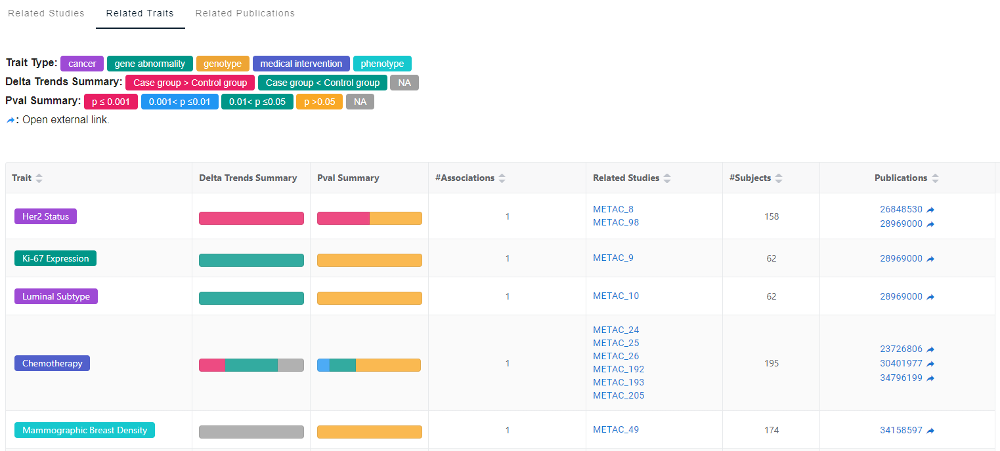

# 1. MACdb Introduction 

## 1.1 Metabolomics in cancer

**Metabolomics** is the global analysis of metabolites from blood, urine, tissue extracts, or other body fluids which can provide critical information about the cancer status. Metabolomics reflects the sum of alterations occurring at the DNA, RNA, and protein levels, and is used in diagnosis, monitoring, and treatment of cancer (Figure 1.1). 

<a style="font-size:16px"  href="https://www.sciencedirect.com/science/article/abs/pii/S0009912020304434?via%3Dihub" target="_blank" > Figure 1.1 Application of metabolomics in cancer patients (Tayanloo-Beik A et al.)

</a>

## 1.2 Our mission

Here we present **MACdb**, a curated knowledgebase that collects identified metabolites associations in cancer researches. As one of the core resources in the National Genomics Data Center of China, MACdb is devoted to providing a comprehensive collection of high-quality Cancer-Metabolite associations, to help users quickly and easily to identify complex cancer-trait (e.g. cancer, medical intervention, gene abnormality, phenotype, genotype, etc.) associated metabolite markers. Unlike The Human Metabolome Database (HMDB, https://hmdb.ca/), MACdb features manual curation of metabolites knowledge from extensive cancer publications, and groups these metabolites by complex cancer-trait ontology. MACdb provides open access which would serve as a valuable resource for the global cancer-metabolite research community. 

# 2. Data curation

## 2.1 Overview

The overview of the MACdb curation model is shown in Figure 2.1, Users can find the curation detailed process in 2.3.

Figure 2.1 MACdb curation model

## 2.2 Criteria

### 2.2.1 Study

Differential metabolites or metabolite profiles are eligible for integration into MACdb Study if they meet the following criteria:

- Have downloadable PubMed articles;
- Study on case and/or control cohorts;
- Study on human cancer-associated traits;
- Study condition;
- Provide differentially identified metabolites or metabolite profiles association;

### 2.2.2 Cohort

The cohort information provides the basic characteristics of the cancer and/or control population. Curated information is collected below. 

- Basic information of the case and/or control group (including group name, age, gender and/or sample size);
- Patients' cancer type and subtype information;
- Sample source;
- Sequencing platform;

### 2.2.3 Trait

Trait information is extracted from manual curation of detailed study information from publications. Then Trait information is mapped to the standardized terms in Experimental Factor Ontology (EFO), combines parts of several other biological ontologies, such as Human Phenotype Ontology (HPO), Ontology for Biomedical Investigations (OBI), and Mondo Disease Ontology (MONDO). 

### 2.2.4 Metabolite

The metabolite was standardized by using PubChem as ontology. 

- By retrieving the metabolite names in the PubChem database, the best matching or unique matching ID will be used as the metabolite PubChem ID;
- The standardized names obtained through PubChem ID are displayed in "Standard Name", and the names reviewed in the literature are displayed in the "Metabolite Name";

### 2.2.5 Association

The associations contained in MACdb are meeting the following criteria:

1). Profiling information of the patient group, the metabolite name, and concentration information are included.

2). For the comparison of case and control groups, associations that meet any of the following conditions are included.
   - Concentration information in case and control (including mean/median concentration, concentration range or concentration SD (Standard Deviation));
   - Significance information (p-value and/or q-value);
   - Metabolite change trends (Fold change, log2(Fold Change) and/or up/down/unchanged trend)
   - VIP (Variable importance in the projection);
   - Prediction accuracy: AUC (Area Under the Curve) and/or AUROC (Area Under the Receiver Operating Characteristic curve);
   - Sensitivity and/or specificity;

## 2.3 Curation process

In order to obtain high-quality information of cancer-associated metabolites, we established a standardized curation process, which included three main steps: literature search, study curation, and association curation (Figure 2.1). 

### 2.3.1 Literature search
We use predefined keywords to conduct the literature search in PubMed. The current MACdb version includes 17 categories of cancer with high incidence or mortality (including Breast cancer, Prostate cancer, Lung cancer, Colorectal Cancer or colon cancer, Bladder Cancer, Pancreatic cancer or pancreas cancer, Kidney carcinoma, Brain cancer or Glioma, Liver cancer, Ovarian cancer, Melanoma, Uterine cancer, Oral cancer, Thyroid cancer, Esophagus cancer, Leukemia, Lymphoma). The literature will be included in MACdb only if it contains cancer-associated traits and metabolite associations. The detailed information of the publications is obtained through PubMed2XL (https://pubmed2xl.com/xml/). 

### 2.3.2 Study curation

We manual curate the study detailed information from publications, including basic information of case and/or control group (including group name, age, gender and/or sample size), cancer type and subtype. To unify the representation of biological traits, entities are mapped to the standardized terms in Experimental Factor Ontology (EFO), partially with Human Phenotype Ontology (HP), Ontology for Biomedical Investigations (OBI), Mondo Disease Ontology (MONDO). 

### 2.3.3 Association curation

The association relationship that meets any of the following criteria will meet the requirement. The criteria include concentration information, significance information, change trend, VIP, prediction accuracy, sensitivity and/or specificity. Most of the studies satisfy at least three criteria. Next, all metabolite name was standardized to PubChem name and ID. 

# 3. How to use MACdb？

## 3.1 Home page

On the homepage, MACdb offers the statistic information, additionally with a fast searching function.

### 3.1.1 Home page statistic

On the homepage, MACdb offers the statistic information, including 40,710 associations, 5,405 metabolites, 269 traits, 1,127 studies, 462 publications. Users can click the statistics link to the corresponding browse page. Among them, associations and metabolites that are corresponded to metabolite page in browse.

### 3.1.2 Home page searching

In the quick searching box, users can search for various interested terms, including:

- Metabolite name, e.g., Glutamine; 
- PubChem ID,  e.g., 5961;  
- Trait name,  e.g., Bladder Cancer;  
- Trait type,  e.g., medical intervention;  
- Cancer type,  e.g., breast cancer;  
- Study ID,  e.g., METAC_342;  
- Study Condition,  e.g., Information on metabolites significantly differentiating urinary profiles from bladder cancer patients and healthy volunteers.;  
- Study Conclusion,  e.g.,  amino acid metabolism is particularly affected in BCa patients.;  
- PubMed ID,  e.g., 31171223;  
- PubMed Title,  e.g., Urinary metabolomic signature of muscle-invasive bladder cancer: A multiplatform approach.;  

In this part, we use fuzzy matching to map the searching item onto the Metabolite, Trait, Study, and Publication levels. Please see the following table for the relationship between the searching item and its corresponding level.

|Seariching item|Searching Level|
|:---|:---|
|PubChem_CID|Metabolite|
|PubChem_name|Metabolite|
|Metabolite_name|Metabolite|
|Cancer_type|Metabolite|
|Trait_Ontology|Trait|
|Trait_type|Trait|
|Cancer_type|Trait|
|Cohort_id|Study|
|Condition|Study|
|Cancer_type|Study|
|Conclusion|Study|
|Title|Publication|
|Conclusion|Publication|
|Cancer_type|Publication|
|PMID|Publication|

An example was shown by how to get the metabolite-related Trait, Study and Publication by searching a metabolite from Home page (Figure 3.1). 

Figure 3.1 Metabolite search at Home Page

## 3.2 Browse page

On the Browse page, information at the Metabolite, Trait, Study, Publication levels are provided (Figure 3.2.A). Users can quickly get their interested information from corresponding modules. Additionally, interrelated functions at four levels can help users quickly find information at other levels from the relevant modules. Interrelated relationships are shown in Figure 3.2.B. 

Figure 3.2 Browse page provides information at Metabolite, Trait, Study, Publication levels

### 3.2.1 Metabolite Level

The metabolite page displays metabolite detailed chemical information，additionally with its association with Study, Trait, Publication and so on. Users can search for cancer types, traits, and change trends associated with specific metabolites. Moreover, users can search for the potential metabolites associated with a particular cancer type or trait. 

#### 3.2.1.1 Metabolite Summary Page

Figure 3.3 Metabolite summary page

The part ① provides the main information of metabolite, including the following contents:

- Standard name: The standardized metabolite name from PubChem database. Users can click the metabolite standard name to see the detailed metabolite information, metabolite-related Traits, Studies and Publications;
- Metabolite name: Metabolite name reviewed in the literature. Due to metabolite synonymous names, one standard name may correspond to multiple metabolite names;
- PubChem ID: Metabolite ID in PubChem database (https://pubchem.ncbi.nlm.nih.gov/). Users can directly access the detailed metabolite information to PubChem database from the external links;
- #Studies: Total number of studies on this metabolite in MACdb;
- #Subjects: The number of total subjects study this metabolite;
- Delta trends summary: This part provides the metabolite change trends summary in all MACdb studies, which is displayed in the form of capsule diagram. Red indicates the uptrend in cases, green indicates the down trend in cases, gray indicates that no change trend was provided by the article, and gray color means no change in case and control group. The proportion in each part will be shown while mouse over the capsule map;
- Pval Summary: This part provides the sum of p-values of this metabolite in all studies. It is also shown in the form of capsule diagram. Red indicates p-value less than 0.001, blue indicates the p-value between 0.001 and 0.01, green indicates p-value between 0.01 and 0.05, yellow indicates p-value that is greater than 0.05, and gray indicates that no metabolite p-value is provided. The proportion in each part will be shown while mouse over the capsule map;
- Trait: This part provides metabolite associated traits, and the number indicates the number of metabolite-trait associations in MACdb. Trait is marked with different colors according to different trait types. Users can access to the trait detailed page and its related information by clicking the trait;
- Cancer type: This part provides the type of disease associated with metabolite. The number indicates the number of metabolite-cancer associations in MACdb;

The part ② is the filter part, including the following aspects:

- Metabolite name: Standard name and metabolite name are all supported;
- Trait type: Cancer, gene abnormality, medical intervention and phenotype are provided;
- Trait: String-fuzzy-matching is supported;
- Cancer type: 10 types of cancer with high incidence or mortality;
- Delta trend: Trends with up, down, remain, NA are provided;
- p-value: Filter p-values by adjusting the maximum and minimum values;

The part ③ is the download part, where users can choose what to download:

- Contents: Information at Standard name, Metabolite name, PubChem ID, Studies, Subjects, Delta Trends Summary, PVAL summary, Pval Summary, Trait and Disease levels are optional;
- Format: CSV, HTML, XML, and TXT are supported;

The part ④ is the online display control part. Columns that can be displayed online can be selected by this part. 

#### 3.2.1.2 Metabolite Detailed Page

By Clicking a metabolite, detailed information about chemical characteristics and metabolite associated traits, studies, publications are shown. From here, users can know which trait, study, and publication have reported this metabolite. Glutamine is shown as a specific metabolite to show how to get detailed information from Metabolite Detail Page.

 1). Chemical characteristics are shown on the top of the Metabolite detailed page. Information at PubChem CID, Molecular Formula, Molecular Weight, Synonyms (Figure 3.4.A), 2D/3D STRUCTURE (Figure 3.4.B), Computed Descriptors (Figure 3.4.C), Computed Properties (Figure 3.4.D), Classification (Category) (Figure 3.4.E) ,Interacted Genes (Figure 3.4.F) levels are provided. Users can click 2D STRUCTURE and 3D STRUCTURE to switch the corresponding structure. 

Figure 3.4 Metabolite basic chemical information

 2). Metabolite-related studies are shown by clicking 'Related Studies' module (Figure 3.5). The information is shown below. With the same design as the metabolite home page, users can customize the displayed columns and downloaded content. 

Figure 3.5 Metabolite-related studies information

Default display items:
- Study: The study ID is given for a profiling/comparison condition in MACdb. Users can go to the corresponding study detailed page by clicking ID;
- Category: Profiling or Case vs.Control, different category are marked by different colors;
- Trait: Trait is extracted from the comparison or profiling condition. Users can go to the corresponding trait detailed page by clicking trait;
- Condition: Comparison or profiling condition from the articles;
- Tissue: Sampling source for metabolite detection;
- Cancer Type: Cancer types in the study population;
- Case Information: Case name, age, sex size information;
- Case Concentration: Metabolite concentration in the case group;
- Control Information: Control name, age, sex size information;
- Control Concentration: Metabolite concentration in the control group;
- Platform: Metabolite detection platform;
- Delta Trend: Metabolite trend in the study;
- P Value: P-value summary in the study;
- Conclusion: Conclusion extracted from the article;

Optional display items:
- Cancer Subtype: Cancer subtype of the cancer cohort;
- Unit: Metabolite unit;
- Q Value: Q-value in the study;
- mz: m/z mass to charge ratio;
- Peak Position: Metabolite peak position in the study;
- VIP: Variable importance in the projection;
- RT: Retention time;
- Molecular Formula: Metabolite molecular formula from the article;
- Fold Change: Fold change for case/control;
- Log2 Fold Change: Log2 Fold change for case/control;
- AUC: Area Under the Curve;
- ROC: Area Under the Receiver Operating Characteristic curve;
- Adduct: Adduct information extracted from article;
- Sensitivity: The proportion of the positive samples that were correctly classified;
- Specificity: The proportion of the negative samples that were correctly classified;

3). Metabolite-related traits are shown by clicking 'Related Traits' module (Figure 3.6). The information is shown below. With the same design as the metabolite home page, users can customize the displayed columns and downloaded content. 

Figure 3.6 Metabolite-related traits information

Default displayed items:
- Trait: Trait is extracted from the comparison or profiling condition. Users can go to the corresponding trait detailed page by clicking trait;
- Delta Trends Summary: Metabolite change trends summary in the trait;
- Pval Summary: P-value summary in the trait;
- #Associations: Number of Metabolite-Trait associations;
- Related Studies: Studies that researched on the Metabolite-Trait associations. Users can go to the corresponding study detailed page by clicking ID;
- #Subjects: Number of subjects that researched on the Metabolite-Trait associations;
- Publications: PubMed ID that researched on the Metabolite-Trait associations. Users can go to the publication detailed page in MACdb by clicking PubMed ID, or users can access to the PubMed from the external links;

 4). Metabolite-related publications are shown by clicking 'Related Publications' module (Figure 3.7). The information is shown below. With the same design as the metabolite home page, users can customize the displayed columns and downloaded content. 

Figure 3.7 Metabolite-related publications information

Default displayed items:
- Title: PubMed title. Users can go to the corresponding publication detailed page by clicking title;
- PubMed ID: PubMed ID. Users can access to the PubMed from the external links;
- Cancer Type: Cancer types in the study population;
- Conclusion: The conclusion of the metabolite which is extracted from the article;
- Journal: Publishing journal;
- Publish Information: Volume, Issue, Pages;
- Date of Publish: Publishing date;

### 3.2.2 Trait Level

The trait page displays trait detailed information (Figure 3.8)，additionally with its association with Metabolite, Study, Publication and so on. Users can search for the potential metabolites or publications associated with a particular cancer type or trait. 

#### 3.2.2.1 Trait Summary Page

Figure 3.8 Trait summary page

The part ① provides the main information of Trait, including the following contents:

Default displayed items:
- Trait: Trait is extracted from the comparison or profiling condition. Users can go to the corresponding trait detailed page by clicking trait;
- EFO Ontology: Trait mapped to EFO Ontology;
- Cancer Type;
- #Associations: Number of Trait-Metabolite associations;
- #Studies: Number of studies that researched on the trait;
- #Subjects: Number of subjects that researched on the trait;
- Publications: PubMed ID that researched on the trait. Users can go to the publication detailed page in MACdb by clicking PubMed ID, or users can access to the PubMed from the external links;

Optional display items:
- Trait Ontology ID: Trait Ontology ID in MACdb;
- EFO Ontology ID: Trait EFO Ontology ID;
- Trait Type: Cancer, gene abnormality, medical intervention, and phenotype are provided;

The part ② is the filter part, including the following aspects:
- Trait type: Cancer, gene abnormality, medical intervention, and phenotype are provided;
- Trait: String-fuzzy-matching is supported;
- Cancer type;

#### 3.2.2.2 Trait Detailed Page

By Clicking a trait, detailed information about this trait and its associated metabolites, studies, and publications. From here, users can know which metabolite, study, and publication have reported this trait. Adenocarcinoma (AC) is shown as a specific trait to show how to get detailed information from Trait Detail Page. 

 1). Trait basic information provides Trait Ontology ID, number of Trait-Metabolite associations, studies, subjects and publications. (Figure 3.9) 

Figure 3.9 Trait basic information

 2). Trait-related metabolites are shown by clicking 'Related Metabolites' module (Figure 3.10). The information is shown below. With the same design as the metabolite home page, users can customize the displayed columns and downloaded content. 

Figure 3.10 Trait-related metabolite information

Default display items:
- Standard name: The standardized metabolite name from PubChem database. Users can click the metabolite standard name to see the detailed metabolite information, metabolite-related Traits, Studies and Publications;
- Metabolite name: Metabolite name reviewed in the literature. 
- PubChem ID: Metabolite ID in PubChem database. Users can directly access the detailed metabolite information to PubChem database from the external links;
- #Studies: Number of studies that researched on the trait;
- #Subjects: Number of subjects that researched on the trait;
- Delta Trends Summary: Metabolite change trends summary in the trait;
- Pval Summary: Metabolite p-value summary in the trait;
- Cancer Type;

 3). 'Related Studies' and 'Related Publications' modules are the same in Metabolite Detailed Page. 

### 3.2.3 Study Level

The study page displays study detailed information，additionally with its association with Metabolite, Trait, Publication and so on. Users can search for the potential metabolites or publications associated with a particular cancer type, trait or condition. 

#### 3.2.3.1 Study Summary Page

Figure 3.11 Study summary page

The part ① provides the main information of Study (Figure 3.11), including the following contents:

Default displayed items:
- Study: The study ID is given for a profiling/comparison condition in MACdb, users can go to the corresponding study detailed page by clicking ID;
- Trait: Trait is extracted from the comparison or profiling condition. Users can go to the corresponding trait detailed page by clicking trait;
- Condition: Comparison or profiling condition from the articles;
- Tissue: Sampling source for metabolite detection;
- Cancer Type;
- Case Information: Case name, age, sex size information;
- Control Information: Control name, age, sex size information;
- Delta Trends Summary: Metabolite trend in the study;
- Pval Summary: P-value summary in the study;
- Conclusion: Conclusion extracted from the article;
- Publication: PubMed ID that researched on the study. Users can go to the publication detailed page in MACdb by clicking PubMed ID, or users can access to the PubMed from the external links;

Optional display items:
- #Metabolites: Number of metabolites in the study;
- Category: Profiling or Case vs.Control;
- Cancer Subtype: Cancer subtype of the cancer cohort;
- Platform: Metabolite detected platform;

The part ② is the filter part, including the following aspects:

- Trait type: Cancer, gene abnormality, medical intervention, and phenotype are provided;
- Trait: String-fuzzy-matching is supported;
- Cancer type;
- Tissue: Sample source;
- Condition: String-fuzzy-matching is supported;
- Conclusion: String-fuzzy-matching is supported;
- Delta trend: Trends with up, down, remain, NA are provided;
- P-value: Filter p-values by adjusting the maximum and minimum values;

#### 3.2.3.2 Study Detailed Page

By Clicking a study, detailed information about this study and its associated metabolites, traits, publications. From here, users can know which metabolite, trait, and publication have reported this study. METAC_100 is shown as a specific study to show how to get detailed information from Study Detail Page. 

1). Study basic information provides Category, Trait, PubMed ID, Tissue, Cancer Type, Cancer subtype, Condition, Conclusion, and Group information (Figure 3.12). 

Figure 3.12 Study basic information

 2). Study-related Trait are shown by clicking 'Related Traits' module (Figure 3.13). The information is shown below. With the same design as the metabolite home page, users can customize the displayed columns and downloaded content. 

Figure 3.13 Study-related trait information

Default display items:
- Trait: Trait is extracted from the comparison or profiling condition in the study. Users can go to the corresponding trait detailed page by clicking trait;
- Delta Trends Summary: Metabolite trend in the study;
- Pval Summary: P-value summary in the study;
- #Associations: Number of Metabolite-Trait associations in the study;
- #Subjects: Number of subjects that researched on the Metabolite-Trait associations in the study;
- Publications: PubMed ID that researched on study. Users can go to the publication detailed page in MACdb by clicking PubMed ID, or users can access to the PubMed from the external links;

 3). 'Related Metabolites' and 'Related Publications' modules are the same in Metabolite or Trait Detailed Page. 

### 3.2.4 Publication Level

The publication page displays publication detailed information，additionally with its association with Metabolite, Trait, Study and so on. Users can search for the potential metabolites or publications associated with PubMed ID, title, particular cancer type or trait. 

#### 3.2.4.1 Publication Summary Page

Figure 3.14 Publication summary page

The part ① provides the main information of Publication (Figure 3.14), including the following contents:

Default displayed items:
- Title: PubMed title. Users can go to the corresponding publication detailed page by clicking title;
- Conclusions: Conclusion extracted from the article;
- Related Traits: Traits that the article researched. Users can go to the corresponding trait detailed page by clicking trait;
- Cancer type;
- PubMed ID: Users can access to the PubMed from the external links;
- Journal: Publishing journal;
- Publish Information: Volume, Issue, Pages;
- #Metabolites: Number of metabolites in the article;
- #Studies: Number of studies in the article;

The part ② is the filter part, including the following aspects:

- Trait type: Cancer, gene abnormality, medical intervention, and phenotype are provided;
- Trait: String-fuzzy-matching is supported;
- PubMed ID;
- Title: String-fuzzy-matching is supported;
- Published year: String-fuzzy-matching is supported;
- Conclusion: String-fuzzy-matching is supported;

#### 3.2.4.2 Publication Detailed Page

By Clicking a publication, detailed information about this publication and its associated metabolites, traits, and studies. From here, users can know which metabolite, trait, and study have reported this publication. "Metabolic signatures of lung cancer in biofluids: NMR-based metabolomics of urine." is shown as a specific publication to show how to get detailed information from Publication Detail Page. 

 1). Study basic information provides Title, PubMed ID, Journal, Volume, Issue, Pages, Date, Authors, Abstract, and Conclusions (Figure 3.15). 

Figure 3.15 Publication basic information

 2). 'Related Metabolites', 'Related Traits' and 'Related Studies' modules are the same in Metabolite or Trait or Studies Detailed Page. 

## 3.3 Knowledge graph page
Knowledge graph provides landscape visualization in MACdb database. Users can select the central node type (Cancer, Trait or Metabolite), node content, Max p-value, and/or evidence strength level (Publication or Study, and the minimum number of evidence) to display the association landscape.

The mechanism of the knowledge graph is shown in the Figure 3.16. 

MACdb use Cancer, Trait, and Metabolite as nodes and associations of Cancer-Trait and Trait-Metabolite to construct the knowledge graph. Before the knowledge graph construction, we initially filter data in MACdb by p value from the original papers. Then, unique combination of Cancer, Trait, and Metabolite will be selected, and then count the number by study count or publication count (as shown above). It should be noted that center node, p-value, and study or publication minimum count can be applicated as filters. After center node, study or publication minimum count, and/or p-value is selected by users. MACdb uses two-step process to construct the association knowledge graph. 

- Node construction. The number of associations (rows as shown above) is reflected to the node size of Cancer, Trait, and Metabolite. That means the size of node indicates the associations numbers linked to this node. 

- Edge construction. Edge means the association between two nodes. For example, at row 1, edge1 indicates the association between Cancer A node and Trait A node. Edge2 indicates the association between Trait A node and Metabolite A node. The edge width reflects the sum of counts between nodes.

Figure 3.16 The mechanism of knowledge graph in MACdb

The usage of the knowledge graph is shown in the Figure 3.17. 

1). Select type of center node. Users can choose Cancer, Trait, or Metabolite as the center node (Figure 3.17 ①). 

2). Select Node content. According to the center node, user can choose node content. For example, user choose metabolite as center node, a certain metabolite like Creatitine can be chosen as the node content (Figure 3.17 ②).

3). Max P Value. Users set filter the knowledge graph by p-value threshold in this part (Figure 3.17 ③).

4). Select association-based level and count. Study level and Publication level are provided, and minimum count can be chosen (Figure 3.17 ④).

5). Knowledge graph. Knowledge graph is shown as Figure 3.17 ④. Users can access to the metabolite or trait by clicking the dot on the graph. The size of nodes in the graph is related to the number of relationships.

6). Legend and displayed level. Blue node indicates metabolites, green node indicates trait, yellow node indicates cancer. Users can hide the corresponding relationship by clicking legend.

7). Labels setting. Users can hide or show labels by clicking it.

Figure 3.17 The usage of knowledge graph in MACdb

## 3.4 Tools Page

### 3.4.1 Mapping name to PubChem ID

MACdb provides a web tool to help users standardize metabolites conveniently and concisely, which plays an important role in standardizing the metabolite name in MACdb. MACdb parses the data from PubChem database to build a consensus mapping from metabolite names to its PubChem CID. In brief, files are download FTP of PubChem website, including CID-Title, CID-Synonym-filtered, CID-InChI-Key, and CID-Mass. Totally, 226,467,569 metabolites are integrated, standardized, and dumped to MySQL relational database. Index files are built to accelerate searching performance. Furthermore, MACdb implements a job queue in the backend, multiple programs can run separately to minimize the waiting time. 

The usage of the mapping metabolite name to PubChem ID tool is shown in the Figure 3.18.

1). The user inputs the metabolite names that need to be converted into the "Original Metabolite Names" (Figure 3.18.A), and click RUN button (① in Figure 3.18.B). Users can click "#Example" to load the example metabolite names. 

2). The task ID is returned and automatically filled in the query place (② in Figure 3.18.B). Users can check the mapping result by task ID when the conversion finished. Or users can wait a short while because the page will automatically refresh every 5 seconds until the results are presented. e.g., TaskID: o6Usais3RGdgLYT9VBHH7

3). If the number of input metabolites is less than 100, users can check the result on the 'Mapped PubChem Compound IDs' part online or download the mapping result in txt format (Figure 3.18.C).

Figure 3.18 The usage of mapping metabolite name to PubChem ID

### 3.4.2 Enrichment
Enrichemnt tool can be used to enrich cancer types and traits in MACdb. This tool works based on hypergeometric test, P-value correction method is bonferroni. Metabolite name and PubChemID are both supported. You can view the annotation progress at any time through the Task ID. we use a group of 28 metabolites which are obtained from a Tagetes patula L. treated study of chronic nonbacterial prostatitis (CNP) rats as examples (PMID: 31216740). Interestingly, by the enrichment tool of MACdb, the 2nd enriched traits (20/28 hits) and 1st enriched cancer types (21/28 hits) are both prostate cancer.

The usage of the Enrichment tool is shown in the Figure 3.19.

1). The user inputs the metabolite names or PubChemIDs and select the corresponding type. (①, ② in Figure 3.19). Users can click "#Example" to load the example metabolite names. 

2). The task ID is returned and automatically filled in the query place (③ in Figure 3.19). Users can check the mapping result by task ID when the enrichment analysis is finished. e.g.，VpEgYYofN3xxFd3kFQ3vf

3). Enrichment results in bubble chart are shown (④ in Figure 3.19). Users can click Traits or Cancer types to switch result page. Only the top 20 terms are shown on the chart.

4). All enrichment results in table format are displayed (⑤ in Figure 3.19). Users can select the displayed items and download in various file format. 

Figure 3.19 The usage of Enrichment Tool

## 3.5 Downloads Page

Files in txt format at Metabolite, Trait, Study, and Publication levels are provided. Users can download relevant files of interest (Figure 3.20).

Figure 3.20 Download page information

## 3.6 APIs Page

MACdb provides several apis for programmatic access to its data (Figure 3.21). All apis have a common base url: https://ngdc.cncb.ac.cn/macdb/api/

Figure 3.21 APIs page information

## 3.7 Statistics Page

Data statistic graphs are provided from the following aspects to help users obtain an overview of MACdb.

- Number of Publication: Relationship between publications and publishing years in MACdb (Figure 3.22.A);
- Cancer Type: Pie chart showing the proportional relationship between publications and cancer types (Figure 3.22.B);
- Tissue: Heat map shows the relationship between tissue and study number in MACdb (Figure 3.22.C);
- Top 20 Trait: The histogram shows the top 20 types of trait in MACdb (Figure 3.22.D). Users can link to the Trait-associated page by clicking the trait in the histogram;
- Top 50 Metabolites: The histogram shows the top 50 metabolites in MACdb (Figure 3.22.E). Users can link to the Metabolite-associated page by clicking the metabolite in the histogram;
- Additionally, top 5 metabolites in each type of cancers are shown in the table format (unshown in Figure). Users can link to the Metabolite-associated page by clicking the metabolite in the table; 

Figure 3.22 Statistic information

# 4. Disclaimer

1). The information on this website is curated from publications and not intended for direct diagnostic use or medical decision-making without review by a geneticist. Individuals should not change their health behavior solely on the basis of the information contained on this website. If you have any questions about the information contained on this website, please see a health care professional. 

2). MACdb tools use the PubChem as metabolite ontology framework. If this does not comply with the use regulations, please contact us. 

# 5. Contact
    Email:
    sunyanling@big.ac.cn

    Postal Address:
    National Genomics Data Center, China National Center for Bioinformation / Beijing Institute of Genomics, Chinese Academy of Sciences
    No.1 Beichen West Road
    Chaoyang District, Beijing 100101
    China

    Project Leader:
    Yanling Sun

    Web Development:
    Xinchang Zheng

    Data Curaton (alphabet order):
    Guoliang Wang
    Jiani Sun
    Xiaoning Chen
    Xinchang Zheng
    Yanling Sun
    Yibo Wang

    Principal Investigator:
    Wenming Zhao
    Yiming Bao

# 6. Appendix

## 6.1 Cancer categories in MACdb

The current MACdb version included 17 categories of cancer with high incidence or mortality. 

- Breast cancer
- Prostate cancer
- Lung cancer
- Colorectal Cancer or colon cancer
- Bladder Cancer
- Pancreatic cancer or pancreas cancer
- Kidney carcinoma
- Brain cancer or Glioma
- Liver cancer
- Ovarian cancer
- Melanoma
- Uterine cancer
- Oral cancer
- Thyroid cancer
- Esophagus cancer
- Leukemia
- Lymphoma

## 6.2 Traits and ontologies in MACdb

269 traits and its ontologies are shown below. 

|Trait_Ontology|Cancer_type|Trait_Type|EFO_Ontology|EFO_ID|
|:---|:---|:---|:---|:---|
|Acinar Cell Adenocarcinoma (ACA)|lung cancer|cancer|acinar cell carcinoma|EFO:0000216|
|Alpha-Fetoprotein therapy|liver cancer|phenotype|alpha fetoprotein measurement|EFO:0010583|
|IDH Mutation Status|brain cancer|gene abnormality|genetic disorder|EFO:0000508|
|in vivo MRS (magic angle spinning)|brain cancer|phenotype|observational design|EFO:0000629|
|Intraveinous Bevacizumab And Interferon Α|kidney cancer|medical intervention|Therapeutic Procedure|EFO:0010063|
|Invasive Ductal Carcinoma (IDC)|breast cancer|cancer|invasive breast ductal carcinoma|EFO:0000186|
|Ketogenic Diet|breast cancer|medical intervention|diet measurement|EFO:0008111|
|Ki-67 Expression|breast cancer|gene abnormality|genetic disorder|EFO:0000508|
|Kidney Cancer|kidney cancer|cancer|kidney cancer|MONDO:0002367|
|Luminal A|breast cancer|cancer|breast tumor luminal|EFO:0000306|
|Luminal B|breast cancer|cancer|breast tumor luminal|EFO:0000306|
|Limonene Intervention|breast cancer|medical intervention|Therapeutic Procedure|EFO:0010063|
|androgen deprivation therapy (ADT)|prostate cancer|medical intervention|Therapeutic Procedure|EFO:0010063|
|Liver Cancer|liver cancer|cancer|liver cancer|MONDO:0002691|
|Liver Cancer operation|liver cancer|medical intervention|surgical resection|EFO:0005842|
|Luminal Subtype|breast cancer|cancer|breast tumor luminal|EFO:0000306|
|Lung Cancer(LC) |lung cancer|cancer|lung cancer|MONDO:0008903|
|Lung Cancer(LC) Operation|lung cancer|medical intervention|surgical resection|EFO:0005842|
|Lung Cancer(LC) with Chronic obstructive pulmonary disease (COPD)|lung cancer|phenotype|chronic obstructive pulmonary disease|EFO:0000341|
|Lung Cancer(LC) Radiotherapy|lung cancer|medical intervention|Therapeutic Procedure|EFO:0010063|
|Lung Cancer(LC) Tissues|lung cancer|phenotype|sampling site|EFO:0000688|
|Lung Cancer(LC) With chronic bronchitis(CB)|lung cancer|phenotype|chronic bronchitis|EFO:0006505|
|Lung Lump|lung cancer|phenotype|localized superficial swelling, mass, or lump|EFO:0010683|
|Anemia|colorectal cancer|phenotype|anemia (phenotype)|EFO:0004272|
|Lung Metastasis|lung cancer|cancer|metastasis|EFO:0009708|
|Squamous Cell Carcinoma (SCC)|lung cancer|cancer|squamous cell carcinoma|EFO:0000707|
|Lung Surgery|lung cancer|medical intervention|surgical resection|EFO:0005842|
|Lymph Node Metastasis|colorectal cancer|phenotype|metastasis|EFO:0009708|
|Malignant Glioma|brain cancer|cancer|glioma|EFO:0005543|
|Malignant pleural effusion (MPE)|lung cancer|phenotype|pleural effusion|EFO:0009637|
|Mammographic Breast Density|breast cancer|phenotype|mammographic density percentage|EFO:0006502|
|Meningiomas Recurrence|brain cancer|cancer|disease recurrence|EFO:0004952|
|Menopause|breast cancer|phenotype|menopause|EFO:0003922|
|Metabolic Syndrome|breast cancer|phenotype|metabolic syndrome|EFO:0000195|
|Astrocytomas Recurrence|brain cancer|cancer|disease recurrence|EFO:0004952|
|Metabotype|prostate cancer|phenotype|phenotype|EFO:0000651|
|Metastatic Brain Tumors|brain cancer|cancer|metastasis|EFO:0009708|
|Metastatic Breast Cancer|breast cancer|cancer|breast cancer|MONDO:0007254|
|Metastatic Colorectal Cancer (CRC)|colorectal cancer|cancer|metastatic colorectal cancer|EFO:1001480|
|Metastatic Pancreatic Cancer|pancreatic cancer|cancer|metastasis|EFO:0009708|
|MWA(microwave ablation)|lung cancer|medical intervention|Therapeutic Procedure|EFO:0010063|
|Nephrectomy|kidney cancer|medical intervention|surgical resection|EFO:0005842|
|Neutropenia|colorectal cancer|phenotype|neutropenia|MONDO:0001475|
|Non-glial meningioma(MNG)|brain cancer|cancer|meningioma|MONDO:0016642|
|Non-Malignant Females|breast cancer|phenotype|benign female reproductive system neoplasm|MONDO:0000624|
|Astroglioma (ATSR)|brain cancer|cancer|astrocytoma|EFO:0000272|
|Non-Metastatic Breast Cancer|breast cancer|cancer|breast cancer|MONDO:0007254|
|Non‑Metastatic Colorectal Cancer (CRC)|colorectal cancer|cancer|colorectal cancer|EFO:0005842|
|Non-Muscle-Invasive Bladder Cancer|bladder cancer|cancer|bladder tumor|EFO:0000294|
|Non-Muscle-Invasive Bladder Cancer Grade|bladder cancer|cancer|tumor grading|OBI:0600002|
|Non–Small Cell Carcinoma|lung cancer|cancer|non-small cell lung carcinoma|EFO:0003060|
|Non-Small Cell Lung Cancer (NSCLC)|lung cancer|cancer|non-small cell lung carcinoma|EFO:0003060|
|Non-Small Cell Lung Cancer (NSCLC) Progression|lung cancer|cancer|non-small cell lung carcinoma|EFO:0003060|
|Non-Small Cell Lung Cancer (NSCLC) Operation|lung cancer|medical intervention|surgical resection|EFO:0005842|
|Non-Small Cell Lung Cancer (NSCLC) Survival|lung cancer|phenotype|overall survival|EFO:0000638|
|Oligodendroglioma (OLGD) Grade|brain cancer|cancer|tumor grading|OBI:0600002|
|Basal And Luminal Muscle Invasive Bladder Cancer Subtypes|bladder cancer|cancer|bladder tumor|EFO:0000294|
|Oligodendroglioma (OLGD) Survival|brain cancer|phenotype|overall survival|EFO:0000638|
|Oligodendroglioma (OLGD)|brain cancer|cancer|oligodendroglioma|EFO:0000632|
|Ovarian Benign Tumor|ovarian cancer|phenotype|Benign Ovarian Neoplasm|EFO:1000116|
|Ovarian Cancer|ovarian cancer|cancer|ovarian carcinoma|EFO:0001075|
|Ovarian Cancer Operation|ovarian cancer|medical intervention|surgical resection|EFO:0005842|
|Ovarian Cancer Recurrence|ovarian cancer|cancer|disease recurrence|EFO:0004952|
|Palbociclib Treatment|breast cancer|medical intervention|Therapeutic Procedure|EFO:0010063|
|Pancreas Cancer|pancreatic cancer|cancer|pancreatic carcinoma|EFO:0002618|
|Pancreatic Cancer|pancreatic cancer|cancer|pancreatic carcinoma|EFO:0002618|
|Pancreatic Cancer grade|pancreatic cancer|cancer|tumor grading|OBI:0600002|
|Pemetrexed Chemotherapeuty|lung cancer|medical intervention|Therapeutic Procedure|EFO:0010063|
|Oral Carbohydrates|breast cancer|medical intervention|Therapeutic Procedure|EFO:0010063|
|Platinum Chemotherapy|ovarian cancer|medical intervention|platinum measurement|EFO:0010154|
|Colorectal Cancer (CRC) chemotherapy|colorectal cancer|medical intervention|Therapeutic Procedure|EFO:0010063|
|PR Status|breast cancer|cancer|genetic disorder|EFO:0000508|
|Pre-Cachectic Colorectal Cancer|colorectal cancer|cancer|colorectal cancer|EFO:0005842|
|Primary Central Nervous System Lymphoma|brain cancer|cancer|Central Nervous System Lymphoma|EFO:1000157|
|Primary Epithelial Ovarian Cancer|ovarian cancer|cancer|ovarian carcinoma|EFO:0001075|
|Intraductal Papillary Mucinous Neoplasm(IPMN) progression|pancreatic cancer|phenotype|mucinous neoplasm|MONDO:0024338|
|Prostate Anatomical Glandular Zones|prostate cancer|phenotype|sampling site|EFO:0000688|
|Prostate Cancer (Pca) |prostate cancer|cancer|prostate cancer|MONDO:0008315|
|Prostate Cancer (Pca) Bone Metastases|prostate cancer|cancer|bone metastasis|EFO:0009870|
|Prostate Cancer (Pca) Perineural Invasion|prostate cancer|phenotype|nervous system injury|EFO:0009490|
|Prostate Cancer (Pca) Grade|prostate cancer|cancer|tumor grading|OBI:0600002|
|Prostate Cancer (Pca) Stage|prostate cancer|cancer|disease staging|EFO:0000410|
|Prostate Recurrence|prostate cancer|cancer|disease recurrence|EFO:0004952|
|prostatic intraepithelial neoplasia (PIN)|prostate cancer|phenotype|prostate intraepithelial neoplasia|EFO:0002621|
|Qi deficiency (QD)|colorectal cancer|phenotype|traditional Chinese medicine type|EFO:0007637|
|Race|breast cancer|phenotype|ethnic group|EFO:0001799|
|Radiation Therapy|prostate cancer|medical intervention|Therapeutic Procedure|EFO:0010063|
|Benign Lung Nodules|lung cancer|phenotype|lung benign neoplasm|MONDO:0002732|
|Radical Prostatectomy (rPX)|prostate cancer|medical intervention|surgical resection|EFO:0005842|
|Radiotherapy|breast cancer|medical intervention|Therapeutic Procedure|EFO:0010063|
|DMT2 mutated Renal Cell Carcinoma (RCC) |kidney cancer|gene abnormality|genetic disorder|EFO:0000508|
|Rectal Cancer|colorectal cancer|cancer|rectal carcinoma|MONDO:0044937|
|Rectal Proctitis|prostate cancer|phenotype|proctitis|EFO:0005628|
|Renal cell carcinoma (RCC)|kidney cancer|cancer|renal cell carcinoma|EFO:0000681|
|Renal cell carcinoma (RCC) Grade|kidney cancer|cancer|tumor grading|OBI:0600002|
|Renal cell carcinoma (RCC) Metastasize|kidney cancer|cancer|metastasis|EFO:0009708|
|Renal cell carcinoma (RCC) Operation|kidney cancer|medical intervention|surgical resection|EFO:0005842|
|Renal Tumor|kidney cancer|cancer|renal carcinoma|EFO:0002890|
|Benign Renal Tumor|kidney cancer|phenotype|Benign Kidney Neoplasm|EFO:1000111|
|Response Status|breast cancer|phenotype|Therapeutic Procedure|EFO:0010063|
|Neoadjuvant Treatment|breast cancer|medical intervention|Therapeutic Procedure|EFO:0010063|
|Resveratrol|colorectal cancer|medical intervention|Therapeutic Procedure|EFO:0010063|
|Right/Left Colon Cancer|colorectal cancer|cancer|cancer site|EFO:0000312|
|Second Primary Lung Cancer (SPLC)|lung cancer|cancer|lung cancer|MONDO:0008903|
|Secondary Central Nervous System Involvement Of Systemic Lymphoma|brain cancer|cancer|nervous system injury|EFO:0009490|
|Selenium therapy|breast cancer|medical intervention|selenium measurement|EFO:0006331|
|Silibinin Therapy|prostate cancer|medical intervention|Therapeutic Procedure|EFO:0010063|
|Single-Lung Ventilation|lung cancer|phenotype|maximal voluntary ventilation|EFO:0008431|
|Small-Cell Lung Cancer (SCLC)|lung cancer|cancer|small cell lung carcinoma|EFO:0000702|
|Adenocarcinoma (AC)|lung cancer|cancer|adenocarcinoma|EFO:0000228|
|Bladder Cancer|bladder cancer|cancer|bladder tumor|EFO:0000294|
|Smoking|kidney cancer|phenotype|smoking behavior|EFO:0004318|
|SPOP-mutation|prostate cancer|gene abnormality|genetic disorder|EFO:0000508|
|Colon Cancer stage|colorectal cancer|cancer|disease staging|EFO:0000410|
|Sub-Categories Of Breast Cancer Stage III|breast cancer|cancer|disease staging|EFO:0000410|
|SULT1A1 genotype study|breast cancer|genotype|genotype|EFO:0000513|
|SULT1A2 genotype study|breast cancer|genotype|genotype|EFO:0000513|
|SULT1E1 genotype study|breast cancer|genotype|genotype|EFO:0000513|
|Temsirolimus And Intraveinous Bevacizumab|kidney cancer|medical intervention|Therapeutic Procedure|EFO:0010063|
|TGFβ role in Pancreatic ductal adenocarcinoma (PDAC) |pancreatic cancer|gene abnormality|genetic disorder|EFO:0000508|
|Thrombocytopenia|colorectal cancer|phenotype|Thrombocytopenia|HP:0001873|
|Bladder Cancer Grade|bladder cancer|cancer|tumor grading|OBI:0600002|
|Triple Negative|breast cancer|cancer|triple-negative breast cancer|EFO:0005537|
|Pancreatic Cancer stage|pancreatic cancer|cancer|disease staging|EFO:0000410|
|Transurethral Resection|bladder cancer|medical intervention|surgical resection|EFO:0005842|
|Treatment Following Laparoscopic Surgery|colorectal cancer|medical intervention|surgical resection|EFO:0005842|
|Treatment Response|breast cancer|phenotype|Therapeutic Procedure|EFO:0010063|
|Lung Cancer(LC)  with emphysema(E)|lung cancer|phenotype|emphysema|EFO:0000464|
|Urinary Flare|prostate cancer|phenotype|adverse effect|EFO:0009658|
|Pancreatic Cancer Xenograft|pancreatic cancer|phenotype|Xenograft|EFO:0003942|
|Yin deficiency (YD)|colorectal cancer|phenotype|traditional Chinese medicine type|EFO:0007637|
|Prostate Cancer (Pca) sample source|prostate cancer|phenotype|sampling site|EFO:0000688|
|Body Mass Index (BMI)|breast cancer|phenotype|body mass index|EFO:0004340|
|Acute Lymphoblastic Leukemia|leukemia|cancer|acute lymphoblastic leukemia|EFO:0000220|
|Acute Myeloid Leukemia|leukemia|cancer|acute myeloid leukemia|EFO:0000222|
|Advanced Stage Melanoma|melanoma|cancer|disease staging|EFO:0000410|
|AML Chemotherapy|leukemia|medical intervention|Therapeutic Procedure|EFO:0010063|
|AML response|leukemia|medical intervention|Therapeutic Procedure|EFO:0010063|
|Anti-Her2 Therapy |Breast Cancer|medical intervention|Therapeutic Procedure|EFO:0010063|
|Barrett’S Esophagus Cancer|esophagus cancer|cancer|Barrett's esophagus|EFO:0000280|
|Blast Crisis|leukemia|cancer|Blast Phase Chronic Myelogenous Leukemia, BCR-ABL1 Positive|EFO:1000131|
|Cervical Cancer Patients Prognosis|cervical cancer|phenotype|disease prognosis measurement|EFO:0007936|
|Cervical Cancer Recurrent |cervical cancer|cancer|disease recurrence|disease recurrence|
|colorectal cancer (CRC) adverse effects|colorectal cancer|phenotype|adverse effect|EFO:0009658|
|Cervical Intraepithelial Neoplasia|cervical cancer|cancer|cervical intraepithelial neoplasia|MONDO:0022394|
|Cervical Squamous Cell Carcinoma|cervical cancer|cancer|cervical squamous cell carcinoma|EFO:1000172|
|Chemotherapy Response|cervical cancer|phenotype|response to combination chemotherapy|EFO:0007965|
|Chronic Lymphocytic Leukemia (CLL)|lymphoma|cancer|chronic lymphocytic leukemia|EFO:0000095|
|Chronic Myeloid Leukemia|leukemia|cancer|chronic myelogenous leukemia|EFO:0000339|
|Colorectal Cancer Treatment|colorectal cancer|medical intervention|Therapeutic Procedure|EFO:0010063|
|Concurrent Chemoradiotherapy (CCRT)|cervical cancer|medical intervention|Therapeutic Procedure|EFO:0010063|
|Cutaneous T-Cell Lymphoma|lymphoma|cancer|Cutaneous T-cell lymphoma|EFO:0002913|
|Diffuse Large B-Cell Lymphoma (DLBCL)|lymphoma|cancer|diffuse large B-cell lymphoma|EFO:0000403|
|Diffuse Large B-Cell Lymphoma Relapse|lymphoma|cancer|disease recurrence|EFO:0004952|
|Brain Tumours|brain cancer|cancer|brain cancer|MONDO:0001657|
|Doxorubicin-Induced Allergy|Breast Cancer|phenotype|drug allergy|EFO:0009482|
|Esophageal Cancer|esophagus cancer|cancer|esophageal cancer|MONDO:0007576|
|FLT3-ITD/TKD|leukemia|gene abnormality|genetic disorder|EFO:0000508|
|Follicular Lymphoma (FL)|lymphoma|cancer|follicular lymphoma|follicular lymphoma|
|Gender|thyroid cancer|phenotype|sexual and gender identity disorders|MONDO:0000595|
|Hodgkin Lymphoma (HL)|lymphoma|cancer|Hodgkins lymphoma|EFO:0000183|
|Imatinib + Pioglitazone|leukemia|medical intervention|Therapeutic Procedure|EFO:0010063|
|Iodine Excess|thyroid cancer|phenotype|phenotype|EFO:0000651|
|Luminal B Breast Cancer Response|breast cancer|phenotype|Therapeutic Procedure|EFO:0010063|
|Lung Cancer Surgical Resection|lung cancer|medical intervention|surgical resection|EFO:0005842|
|BRCA1 Gene Mutations|breast cancer|gene abnormality|BRCA1 mutation carier status|EFO:0011021|
|Malignant Melanoma|melanoma|cancer|melanoma|EFO:0000756|
|Medullary Thyroid Carcinoma|thyroid cancer|cancer|medullary thyroid gland carcinoma|MONDO:0015277|
|Metastatic Papillary Thyroid Carcinoma|thyroid cancer|cancer|metastasis|EFO:0009708|
|Multiple Myeloma (MM)|lymphoma|cancer|multiple myeloma|EFO:0001378|
|Neoadjuvant Chemotherapy response|bladder cancer|phenotype|response to platinum-based neoadjuvant chemotherapy|EFO:0007943|
|Non-Early-Stage Lung Cancer|lung cancer|cancer|disease staging|EFO:0000410|
|Non-Hodgkin’S Lymphoma|lymphoma|cancer|non-Hodgkins lymphoma|EFO:0005952|
|Oral Cancer|oral cancer|cancer|oral cavity cancer|EFO:0005570|
|Oral Cavity Squamous Cell Carcinoma|oral cancer|cancer|lip and oral cavity squamous cell carcinoma|MONDO:0044710|
|Oral Squamous Cell Carcinoma|oral cancer|cancer|oral squamous cell carcinoma|EFO:0000199|
|BRCA1-like|breast cancer|gene abnormality|BRCA1 mutation carier status|EFO:0011021|
|Oral Squamous Cell Carcinoma Operation|oral cancer|medical intervention|surgical resection|EFO:0005842|
|Extranodal Extension|oral cancer|phenotype|phenotype|EFO:0000651|
|Papillary Thyroid Microcarcinoma|thyroid cancer|cancer|papillary thyroid carcinoma|EFO:0000641|
|Fatigue|leukemia|phenotype|Fatigue|HP:0012378|
|PTC (Papillary Thyroid Carcinoma) Men|thyroid cancer|phenotype|sexual and gender identity disorders|MONDO:0000595|
|Response to TKI Treatment|leukemia|phenotype|Therapeutic Procedure|EFO:0010063|
|RUNX1-RUNX1T1|leukemia|gene abnormality|genetic disorder|EFO:0000508|
|Sex|oral cancer|phenotype|sexual and gender identity disorders|MONDO:0000595|
|Papillary Thyroid Carcinoma Stage|thyroid cancer|phenotype|disease staging|EFO:0000410|
|Triple Negative Breast Cancer Response|breast cancer|phenotype|Therapeutic Procedure|EFO:0010063|
|Breast Cancer|breast cancer|cancer|breast cancer|MONDO:0007254|
|Papillary Thyroid Cancer|thyroid cancer|cancer|papillary thyroid carcinoma|EFO:0000641|
|Thyroid Cancer|thyroid cancer|cancer|thyroid carcinoma|EFO:0002892|
|Breast Cancer Death|breast cancer|phenotype|death from disease|EFO:0030050|
|Breast Cancer Grade|breast cancer|cancer|tumor grading|OBI:0600002|
|Adjuvant And Metastatic endocrine therapy (ET) Treatment|breast cancer|medical intervention|Therapeutic Procedure|EFO:0010063|
|Breast Cancer Intervention|breast cancer|medical intervention|Therapeutic Procedure|EFO:0010063|
|Breast Cancer Operation|breast cancer|medical intervention|surgical resection|EFO:0005842|
|Neoadjuvant Therapy|breast cancer|medical intervention|Therapeutic Procedure|EFO:0010063|
|Tamoxifen (Tam) Treatment|breast cancer|medical intervention|Therapeutic Procedure|EFO:0010063|
|Breast Cancer Recurrence|breast cancer|cancer|disease recurrence|EFO:0004952|
|Breast Cancer Risk|breast cancer|phenotype|breast cancer|MONDO:0007254|
|Breast Cancer Stage|breast cancer|cancer|disease staging|EFO:0000410|
|Cachectic Colorectal Cancer|colorectal cancer|cancer|colorectal cancer|EFO:0005842|
|Castration-Resistant Prostate Cancer (CRPC)|prostate cancer|phenotype|prostate cancer|MONDO:0008315|
|Clear Cell Renal Cell Carcinoma (ccRCC) metastasis|kidney cancer|cancer|metastasis|EFO:0009708|
|Advanced Colorectal Cancer (CRC)|colorectal cancer|cancer|colorectal cancer|EFO:0005842|
|Chemotherapy|breast cancer|medical intervention|Therapeutic Procedure|EFO:0010063|
|Child Pugh Score|liver cancer|phenotype|measurement|EFO:0001444|
|Chromophobe Renal Cell Carcinoma (chRCC)|kidney cancer|cancer|chromophobe renal cell carcinoma|EFO:0000335|
|Clear Cell Renal Cell Carcinoma (ccRCC)|kidney cancer|cancer|clear cell renal carcinoma|EFO:0000349|
|Clear Cell Renal Cell Carcinoma (ccRCC) Stage|kidney cancer|cancer|disease staging|EFO:0000410|
|Colon Cancer|colorectal cancer|cancer|colon carcinoma|EFO:1001950|
|Colorectal Cancer (CRC)|colorectal cancer|cancer|colorectal cancer|EFO:0005842|
|Colorectal Cancer Sample Source|colorectal cancer|phenotype|sampling site|EFO:0000688|
|Dietary Intervention(Freeze-Dried Black Raspberries)|colorectal cancer|medical intervention|surgical resection|EFO:0005842|
|Colorectal Cancer (CRC) Operation|colorectal cancer|medical intervention|surgical resection|EFO:0005842|
|Advanced Metastatic Breast Cancer|breast cancer|cancer|breast cancer|MONDO:0007254|
|Colorectal Cancer (CRC) Progression|colorectal cancer|cancer|colorectal cancer|EFO:0005842|
|Colorectal Cancer (CRC) Recurrence|colorectal cancer|cancer|disease recurrence|EFO:0004952|
|Colorectal Cancer (CRC) stage|colorectal cancer|cancer|disease staging|EFO:0000410|
|Colorectal Neoplasia|colorectal cancer|cancer|colorectal cancer|EFO:0005842|
|Combination Treatment|breast cancer|medical intervention|Therapeutic Procedure|EFO:0010063|
|Colorectal Cancer (CRC) lymph node metastasis |colorectal cancer|cancer|metastasis|EFO:0009708|
|Colorectal Cancer (CRC) metastasis |colorectal cancer|cancer|metastasis|EFO:0009708|
|CYP2D6 genotype|breast cancer|genotype|genotype|EFO:0000513|
|CYP2D6 phenotype|breast cancer|phenotype|phenotype|EFO:0000651|
|CYP3A4 genotype|breast cancer|genotype|genotype|EFO:0000513|
|Lung Cancer(LC) Stage|lung cancer|cancer|disease staging|EFO:0000410|
|CYP3A5 genotype|breast cancer|genotype|genotype|EFO:0000513|
|Pancreatic ductal adenocarcinoma (PDAC) stage|pancreatic cancer|cancer|disease staging|EFO:0000410|
|Early Breast Cancer|breast cancer|phenotype|breast cancer|MONDO:0007254|
|Early Stage Adenocarcinoma (Adc)|lung cancer|cancer|disease staging|EFO:0000410|
|Early Stage Lung Cancer(LC)|lung cancer|cancer|disease staging|EFO:0000410|
|Early Stage Non-Small Cell Lung Cancer (NSCLC)|lung cancer|cancer|disease staging|EFO:0000410|
|Early Stage Squemous Cell Carcinoma (SCC)|lung cancer|cancer|disease staging|EFO:0000410|
|Early Stage Renal Cell Carcinoma (RCC) |kidney cancer|cancer|disease staging|EFO:0000410|
|Early Stage Bladder Cancer|bladder cancer|cancer|disease staging|EFO:0000410|
|Early Stage Epithelial Ovarian Cancer|ovarian cancer|cancer|disease staging|EFO:0000410|
|Renal Cell Carcinoma (RCC) stage|kidney cancer|cancer|disease staging|EFO:0000410|
|Endocrine Therapy|breast cancer|medical intervention|Therapeutic Procedure|EFO:0010063|
|Epithelial Ovarian Cancer|ovarian cancer|cancer|ovarian carcinoma|EFO:0001075|
|ER Status|breast cancer|cancer|genetic disorder|EFO:0000508|
|ERG Rearrangement|prostate cancer|gene abnormality|genetic disorder|EFO:0000508|
|ERPR status|breast cancer|cancer|genetic disorder|EFO:0000508|
|ERPRstatus,Triple Negative|breast cancer|cancer|genetic disorder|EFO:0000508|
|FASN Expression|breast cancer|gene abnormality|genetic disorder|EFO:0000508|
|FAVL expression|bladder cancer|gene abnormality|genetic disorder|EFO:0000508|
|Fulvestrant Treatment|breast cancer|medical intervention|Therapeutic Procedure|EFO:0010063|
|Gemcitabine Treatment|bladder cancer|medical intervention|Therapeutic Procedure|EFO:0010063|
|Non-Small Cell Lung Cancer (NSCLC) stage|lung cancer|cancer|disease staging|EFO:0000410|
|Geriatric Assessment|breast cancer|phenotype|measurement|EFO:0001444|
|Gleason Score|prostate cancer|phenotype|Gleason score measurement|EFO:0007000|
|glial tumour(GT)|brain cancer|cancer|mixed neuronal-glial tumor|MONDO:0016729|
|glioblastoma(GBM)|brain cancer|cancer|brain glioblastoma|EFO:0006545|
|glioblastoma(GBM) Grade|brain cancer|cancer|tumor grading|OBI:0600002|
|glioblastoma(GBM) Stage|brain cancer|cancer|disease staging|EFO:0000410|
|glioblastoma(GBM) Recurrence|brain cancer|cancer|disease recurrence|EFO:0004952|
|Glioma|brain cancer|cancer|glioma|EFO:0005543|
|Glutamine Starvation|ovarian cancer|phenotype|glutamine measurement|EFO:0009768|
|Hand Foot Syndrome|colorectal cancer|phenotype|Hand-foot syndrome|EFO:1001893|
|Aromatase Inhibitors (AI) therapy|breast cancer|medical intervention|Therapeutic Procedure|EFO:0010063|
|Hematological Toxicity|lung cancer|phenotype|hematological toxicity|EFO:0011051|
|Hepatocellular Carcinoma|liver cancer|cancer|hepatocellular carcinoma|EFO:0000182|
|Hepatotoxicity|lung cancer|phenotype|hepatotoxicity|EFO:0011052|
|Her2 Status|breast cancer|cancer|genetic disorder|EFO:0000508|
|IP3R expression|breast cancer|gene abnormality|genetic disorder|EFO:0000508|
|clear cell renal cell carcinoma (ccRCC) grade|kidney cancer|cancer|tumor grading|OBI:0600002|
|High hydrostatic pressure (HHP) treatment|prostate cancer|medical intervention|Therapeutic Procedure|EFO:0010063|
|Ovarian Cancer grade|ovarian cancer|cancer|tumor grading|OBI:0600002|
|Hormone Receptor(HR) Status|breast cancer|cancer|genetic disorder|EFO:0000508|
|Hormone-Sensitive Prostate Cancer (HSPC)|prostate cancer|phenotype|prostate cancer|MONDO:0008315|

## 6.3 The description of each column in MACdb Browse module

<table>
   <tr>
      <td>Browse Module</td>
      <td>Coloumn name</td>
      <td>Description</td>
   </tr>
   <tr>
      <td rowspan="20">Metabolite</td>
      <td>Standard Name</td>
      <td>Metabolite standard name, based on PubChem standarization</td>
   </tr>
   <tr>
      <td>Metabolite Name</td>
      <td>Metabolite name, extracted from publications</td>
   </tr>
   <tr>
      <td>PubChem Cid</td>
      <td>The Cid in PubChem database</td>
   </tr>
   <tr>
      <td>#Study</td>
      <td>Number of Studies</td>
   </tr>
   <tr>
      <td>#Subject</td>
      <td>Number of Stujects</td>
   </tr>
   <tr>
      <td>Delta Trends Summary</td>
      <td>Scale diagram of Delta Trends, capsule format</td>
   </tr>
   <tr>
      <td>Pval Summary</td>
      <td>Scale diagram of p-value, capsule format</td>
   </tr>
   <tr>
      <td>Trait</td>
      <td>Metabolite associated trait name</td>
   </tr>
   <tr>
      <td>Cancer type</td>
      <td>Cancer type</td>
   </tr>
   <tr>
      <td>Molecular Formula</td>
      <td>Metabolite  molecular formula</td>
   </tr>
   <tr>
      <td>Molecular Weight</td>
      <td>Metabolite  molecular weight</td>
   </tr>
   <tr>
      <td>Synonyms</td>
      <td>Metabolite  synonyms name</td>
   </tr>
   <tr>
      <td>2D/3D structure</td>
      <td>Metabolite  2D/3D structure</td>
   </tr>
   <tr>
      <td>Computed Descriptors</td>
      <td>Metabolite computed descriptors</td>
   </tr>
   <tr>
      <td>Computed Properties</td>
      <td>Metabolite computed properties</td>
   </tr>
   <tr>
      <td>Classification (Category)</td>
      <td>Metabolite classification</td>
   </tr>
   <tr>
      <td>Interacted Genes</td>
      <td>Metabolite interaction genes</td>
   </tr>
   <tr>
      <td>“Related Studies” module</td>
      <td>Metabolite “Related Studies” module</td>
   </tr>
   <tr>
      <td>“Related Traits” module</td>
      <td>Metabolite “Related Traits” module</td>
   </tr>
   <tr>
      <td>“Related Publications” module </td>
      <td>Metabolite “Related Publications” module </td>
   </tr>
   <tr>
      <td rowspan="14">Trait</td>
      <td>Trait</td>
      <td>Trait name</td>
   </tr>
   <tr>
      <td>EFO Ontology</td>
      <td>EFO Ontology</td>
   </tr>
   <tr>
      <td>Cancer Type</td>
      <td>Cancer Type</td>
   </tr>
   <tr>
      <td>#Association</td>
      <td>Number of Associations</td>
   </tr>
   <tr>
      <td>#Study</td>
      <td>Number of Studies</td>
   </tr>
   <tr>
      <td>#Subject</td>
      <td>Number of Stujects</td>
   </tr>
   <tr>
      <td>Publications</td>
      <td>Trait associated publications (PubMed ID)</td>
   </tr>
   <tr>
      <td>Trait Ontology ID</td>
      <td>Trait Ontology ID</td>
   </tr>
   <tr>
      <td>EFO Ontology ID</td>
      <td>EFO Ontology ID</td>
   </tr>
   <tr>
      <td>Trait Type</td>
      <td>Trait Type (cancer, gene abnormality, genotype, medical intervention, phenotype)</td>
   </tr>
   <tr>
      <td>#Publication</td>
      <td>Number of Publications</td>
   </tr>
   <tr>
      <td>“Related Metabolites” module</td>
      <td>Trait “Related Studies” module</td>
   </tr>
   <tr>
      <td>“Related Studies” module</td>
      <td>Trait “Related Studies” module</td>
   </tr>
   <tr>
      <td>“Related Publications” module</td>
      <td>Trait “Related Publications” module </td>
   </tr>
   <tr>
      <td rowspan="20">Study</td>
      <td>Study</td>
      <td>Study ID,  internal number in MACdb</td>
   </tr>
   <tr>
      <td>Trait</td>
      <td>Study associated trait name</td>
   </tr>
   <tr>
      <td>Condition</td>
      <td>Study comparision or profiling condition</td>
   </tr>
   <tr>
      <td>Tissue</td>
      <td>Sampling tissue</td>
   </tr>
   <tr>
      <td>Cancer Type</td>
      <td>Cancer Type</td>
   </tr>
   <tr>
      <td>Case Information</td>
      <td>Detailed case information</td>
   </tr>
   <tr>
      <td>Control Information</td>
      <td>Detailed control information</td>
   </tr>
   <tr>
      <td>Delta Trends Summary</td>
      <td>Scale diagram of Delta Trends, capsule format</td>
   </tr>
   <tr>
      <td>Pval Summary</td>
      <td>Scale diagram of p-value, capsule format</td>
   </tr>
   <tr>
      <td>Conclusion</td>
      <td>Conclusion of the study, extracted from the publication</td>
   </tr>
   <tr>
      <td>Publication</td>
      <td>Study associated publications (PubMed ID)</td>
   </tr>
   <tr>
      <td>#Metabolite</td>
      <td>Number of metabolites</td>
   </tr>
   <tr>
      <td>Category</td>
      <td>Case vs. Contol or profiling</td>
   </tr>
   <tr>
      <td>Cancer Subtype</td>
      <td>Cancer Subtype</td>
   </tr>
   <tr>
      <td>Platform</td>
      <td>Profiling platform</td>
   </tr>
   <tr>
      <td>PubMed ID</td>
      <td>PubMed ID</td>
   </tr>
   <tr>
      <td>Group info</td>
      <td>Sampling group information</td>
   </tr>
   <tr>
      <td>“Related Metabolites” module</td>
      <td>Study “Related Studies” module</td>
   </tr>
   <tr>
      <td>“Related Traits” module</td>
      <td>Study “Related Traits” module</td>
   </tr>
   <tr>
      <td>“Related Publications” module</td>
      <td>Study “Related Publications” module </td>
   </tr>
   <tr>
      <td rowspan="19">Publication</td>
      <td>Title</td>
      <td>Title of the publication</td>
   </tr>
   <tr>
      <td>Related Traits</td>
      <td>Publication associated traits</td>
   </tr>
   <tr>
      <td>Cancer type</td>
      <td>Cancer Type</td>
   </tr>
   <tr>
      <td>Conclusions</td>
      <td>Conclusion of the study, extracted from the publication</td>
   </tr>
   <tr>
      <td>PubMed ID</td>
      <td>PubMed ID</td>
   </tr>
   <tr>
      <td>Journal</td>
      <td>Publishing journal</td>
   </tr>
   <tr>
      <td>Publish Information</td>
      <td>Publish Information</td>
   </tr>
   <tr>
      <td>#Metabolite</td>
      <td>Number of metabolites</td>
   </tr>
   <tr>
      <td>#Study</td>
      <td>Number of Studies</td>
   </tr>
   <tr>
      <td>Volume</td>
      <td>Volume of the publication</td>
   </tr>
   <tr>
      <td>Issue</td>
      <td>Publishing issue</td>
   </tr>
   <tr>
      <td>Pages</td>
      <td>Publishing pages</td>
   </tr>
   <tr>
      <td>Date</td>
      <td>Publishing date</td>
   </tr>
   <tr>
      <td>Authors</td>
      <td>Authors of the publication</td>
   </tr>
   <tr>
      <td>Abstract</td>
      <td>Abstract of the publication</td>
   </tr>
   <tr>
      <td>Conclusion(s)</td>
      <td>Conclusion of the study, extracted from the publication</td>
   </tr>
   <tr>
      <td>“Related Metabolites” module</td>
      <td>Publication “Related Studies” module</td>
   </tr>
   <tr>
      <td>“Related Studies” module</td>
      <td>Publication “Related Studies” module</td>
   </tr>
   <tr>
      <td>“Related Traits” module</td>
      <td>Publication “Related Traits” module</td>
   </tr>
   <tr>
   </tr>
</table>